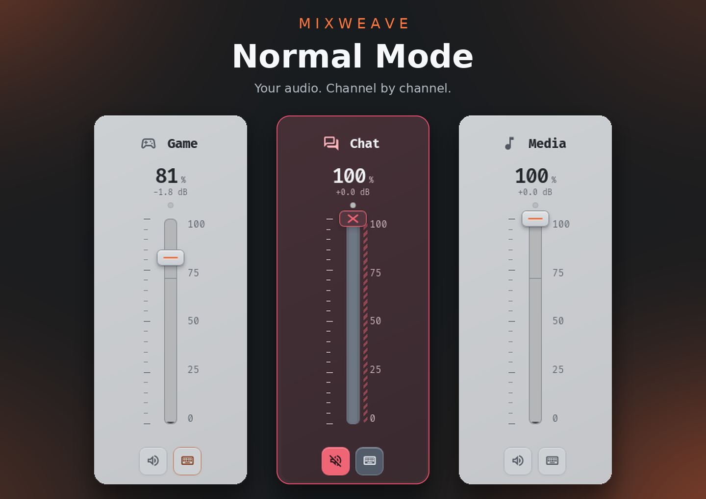
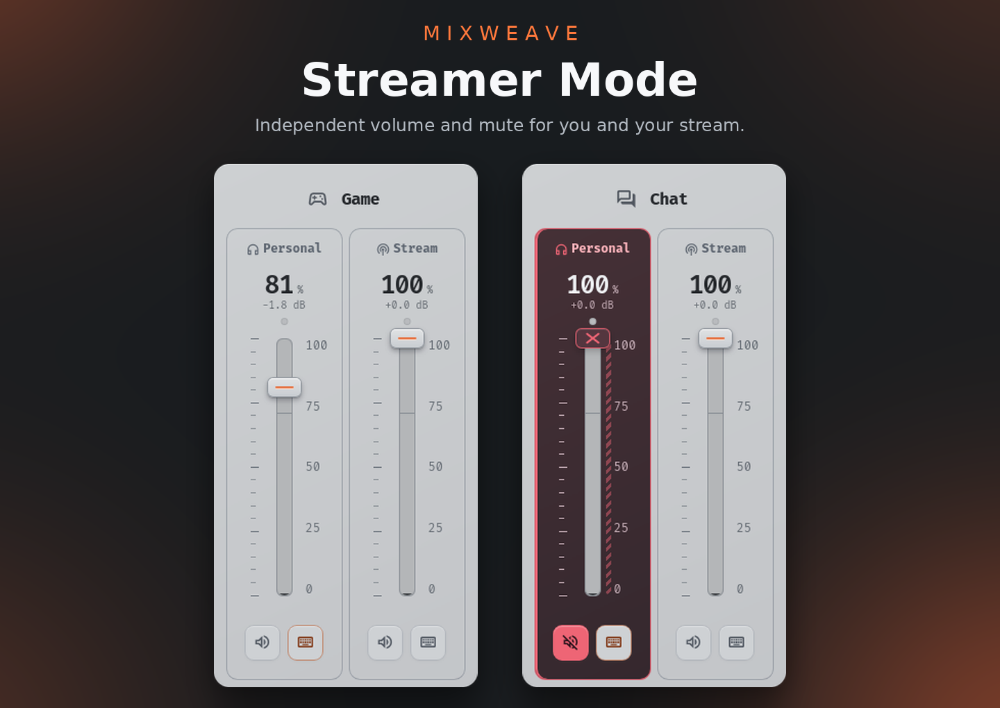
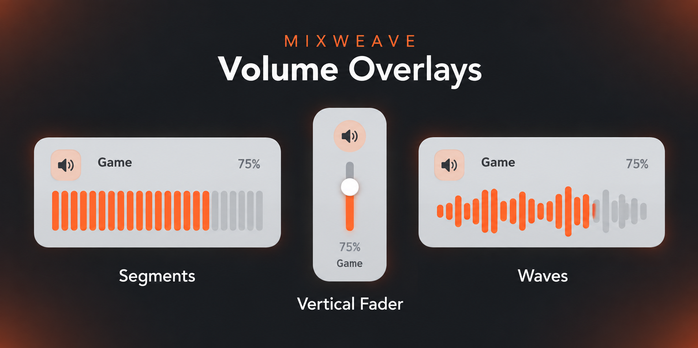

# Mixweave

An audio mixer for Linux with application routing, microphone noise suppression, and independent personal and stream mixes.

## Channel Controls

Adjust volume and mute individual channels, then assign applications to the channels you want. In Normal Mode, you can also select an audio output for each channel.

## Streamer Mode

Manage two independent mixes: what you hear and what your audience hears. Each channel has separate Personal and Stream volume and mute controls.

Select **Streamer Mode** as the audio source in your streaming software. Use the stream monitoring button on Master to preview what your audience will hear.

## Application Routing

The Apps page lists applications that have produced audio and lets you assign each one to a channel. Assignments are remembered across restarts.

## Automatic Profiles

Save your mixer configuration in profiles and link them to application or game executables.

Mixweave switches to the linked profile when the application starts and returns to Default when it closes. If multiple linked applications are running, the most recently started one takes priority.

## Equalizer & Presets

Shape your audio with the equalizer, choose a built-in preset, or create and save your own.

## Microphone Controls

- **Noise suppression:** Reduce microphone background noise using RNNoise.
- **Mute:** Click the microphone mute button to toggle mute.
- **Monitoring:** Hold the mute button to listen to your microphone; release it to stop.

## Keyboard Shortcuts

Assign global shortcuts to raise or lower volume and toggle mute.

- Each press changes volume by 5%.
- Holding a volume shortcut repeats the adjustment.
- An optional setting allows volume up to 150%.

## Volume Overlays

Choose from three styles: **Segments**, **Vertical Fader**, and **Waves**.

Overlays appear when you use volume or mute shortcuts, including in fullscreen. They display the channel name and add a **Stream** label when adjusting stream audio.

## Desktop Integration

- Light, dark, and system themes.
- System tray support.
- Options to launch at login and start minimized.

## Languages

Currently available in:

- English
- Russian — Русский
- Arabic — العربية
- Simplified Chinese — 简体中文

Choose a language in Settings or follow your system language.

## Compatibility

Global keyboard shortcuts and volume overlays support **X11**.

Due to current Wayland integration limitations, these features are supported only on **GNOME under Wayland**. Support for **KDE Plasma under Wayland** is planned.

## Automatic Updates

Automatic updates currently support **AppImage builds only**.

## Acknowledgments

Mixweave is based on [Sonux](https://github.com/Haxinpro/Sonux) by [Haxinpro](https://github.com/Haxinpro). Thanks to the original project and its contributors for providing the foundation for Mixweave.
