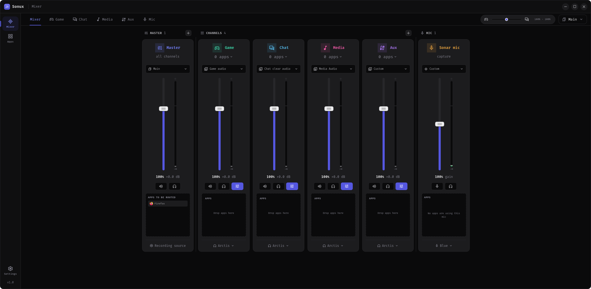
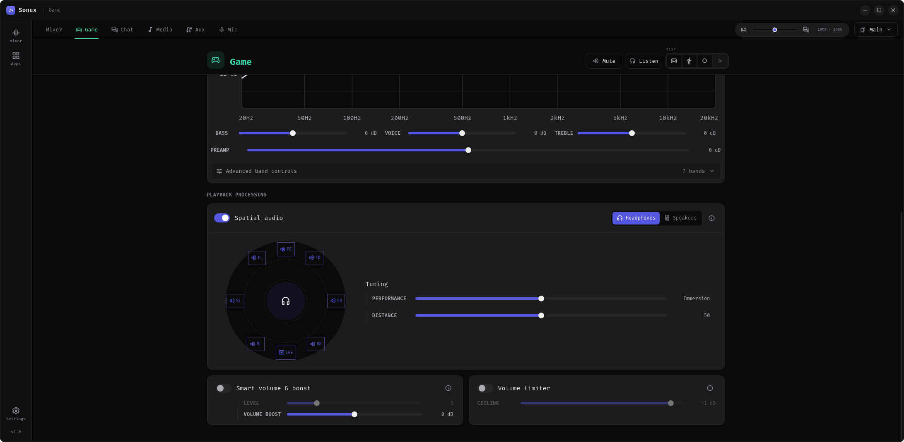

# Mixweave

**Mixweave — SteelSeries Sonar meets Linux.**

> [!IMPORTANT]
> **AI-assisted development disclosure:** I maintain Mixweave and have used
> OpenAI Codex for implementation support, code review, documentation, testing,
> release packaging, and licensing and redistribution checks. I choose which
> suggested changes are included; Codex does not independently maintain or
> publish the project.

> [!CAUTION]
> **Security and third-party software:** I recommend reviewing Mixweave itself,
> its install and build scripts, and every third-party package or library
> before installing or running them. Check the source and publisher, requested
> permissions, package signatures or checksums when available, and only use
> software you trust. This is good practice for all software, not something
> unique to Mixweave.

Mixweave is a Linux-native gaming audio router and mixer built on PipeWire.
It provides per-application channels, recordable mixes, microphone processing,
parametric EQ, and optional 7.1-to-binaural spatial audio.

Mixweave builds on [Sink](https://github.com/NC1107/sink). See
[ATTRIBUTION.md](ATTRIBUTION.md) and [THIRD_PARTY_NOTICES.md](THIRD_PARTY_NOTICES.md)
for upstream and bundled-asset notices.

Mixweave is an independent project and is not affiliated with or endorsed by
SteelSeries.

## What's new in 1.2.0

Version 1.2.0 introduces a redesigned, more consistent interface and a new
first-run tour with faithful previews of the mixer, application routing,
profiles, and microphone processing. Related PipeWire streams are resolved to
one canonical application identity so routing, hiding, drag-and-drop, and
inactive-history actions apply consistently to the complete application.

Mixweave can now load optional user-maintained language packs with safe English
fallbacks. Audio startup is also more reliable: a WirePlumber pre-link policy
routes remembered applications into their Mixweave channel before their first
audio reaches a physical output, removing the brief full-volume onset that
could occur when a browser stream returned after being idle.

See the [changelog](CHANGELOG.md) for the complete update notes and upgrade
information.

## Project status and community

I originally built Mixweave as a small personal learning project because I liked
how SteelSeries Sonar worked on Windows and wanted a similar experience on
Linux. Sink was the closest visually pleasing alternative I found, but it was
missing some settings I wanted. Mixweave would not exist without Sink: most of the
credit for the original application and its foundation belongs to its creator,
NC1107. My work expands that foundation with the controls and audio features I
wanted from a Sonar-like Linux application.

There is no fixed release schedule. I may update Mixweave from time to time and
intend to prioritize known security issues and serious bugs, but users should
not expect continuous feature development or guaranteed support.

Forks are welcome. Feel free to adapt Mixweave to your audio setup or continue its
development in another direction. Please retain the required GPL and
third-party notices when redistributing a fork.

## Distribution compatibility

CachyOS and Arch Linux have been tested. The other rows show intended Linux
targets and package formats, not guaranteed compatibility.

| Distribution | Test status | Intended installation route |
| --- | --- | --- |
| CachyOS | Tested — built and run on CachyOS | Arch package or build from source |
| Arch Linux | Tested — package installed and run on Arch Linux | Arch package or build from source |
| Manjaro, EndeavourOS | Not yet tested | Arch package or build from source |
| Ubuntu 26.04+; Debian/Mint with WirePlumber 0.5+ | Not yet tested | `.deb` package or build from source |
| Fedora, openSUSE | Not yet tested | `.rpm` package or build from source |
| Other PipeWire-based distributions | Not yet tested | AppImage or source build |

All distributions require PipeWire with PulseAudio compatibility and
WirePlumber 0.5 or newer. Reports and fixes for other distributions are
welcome.

## Features

- Route applications into Game, Chat, Media, Aux, or custom channels.
- Route related helper and playback streams together by canonical application
  identity.
- Control channel volume, mute, output device, EQ, and playback processing.
- Create recordable mixes for OBS and other capture software.
- Process one or more microphone channels with AI noise suppression, echo
  cancellation, gain, EQ, gate, compressor, and limiter.
- Save profiles, switch them automatically by linked applications or output
  devices, and use optional global mute shortcuts.
- Create and restore configuration backups.
- Render Game and Media 7.1 channels to binaural stereo for headphones.
- Load optional custom interface translations with per-entry English fallback.

## How Mixweave works

Mixweave builds its mixer on PipeWire. Applications using PulseAudio compatibility
or native PipeWire appear in the audio graph and can be assigned to Game,
Chat, Media, Aux, or user-created channels. Mixweave publishes remembered routes
to a small WirePlumber policy hook, allowing a returning stream to select its
assigned virtual channel before WirePlumber creates its first playback link.
The regular live router remains available as a recovery path.

Each channel has independent volume, output routing, and parametric EQ. Mixweave
also creates recordable mixes that applications such as OBS can select as
audio sources. The microphone path is processed separately with gain, EQ,
noise gate, compressor, and limiter stages.

Game and Media can expose stable eight-channel devices in the standard 7.1
order. With headphone spatial audio enabled, Mixweave filters each virtual speaker
for the left and right ears and combines the eight channels into binaural
stereo. If spatial processing is disabled or its HRTF data cannot be loaded,
Mixweave uses a conventional stereo downmix so channels are not silently lost.

## Languages

Mixweave ships with English, Arabic (العربية, right-to-left), Russian
(Русский) and Simplified Chinese (简体中文). It follows your system language
by default; choose another under **Settings → Appearance → Language**.
English is the fallback for every missing translation. The bundled translations
live in [`src/locales`](src/locales) and corrections are welcome.

## Custom languages

Any other language can be added with a custom pack. Mixweave loads optional user-maintained JSON language packs from
`$XDG_CONFIG_HOME/mixweave/locales` (normally `~/.config/mixweave/locales`). Download
the linked [`custom-example.json`](src/locales/custom-example.json), save a copy
in that folder under a new filename, then update its locale information and
translate the values you want to replace.

From a Mixweave source checkout, the equivalent commands are:

```bash
mkdir -p ~/.config/mixweave/locales
cp src/locales/custom-example.json ~/.config/mixweave/locales/my-language.json
```

Restart Mixweave after saving, then choose the language in **Settings →
Appearance → Language**. Partial packs are supported, unknown or unsafe
entries are ignored, and named placeholders such as `{{profile}}` must be
preserved. Pluralized entries may use CLDR plural keys, and right-to-left packs
can set `direction` to `rtl`. Native tray text, desktop notifications, and
backend error details remain English for now.

## Screenshots

### Mixer



### Game equalizer


### Spatial audio



### Microphone processing


## Installation

Prebuilt Linux packages are available from
[GitHub Releases](https://github.com/iishkas/Mixweave/releases). You can also
build Mixweave from source using the instructions below.

### From a downloaded folder

Open a terminal in the extracted folder and run:

```bash
./install.sh
```

This builds Mixweave and installs it for the current user under `~/.local`. It
does not use `sudo` and does not install system packages.

### From GitHub

```bash
git clone https://github.com/iishkas/Mixweave.git && cd Sonux && ./install.sh
```

### Uninstall

Run this from the same source folder. The installed application is removed,
but its settings are kept.

```bash
./uninstall.sh
```

Configuration is stored as plain JSON under `~/.config/mixweave`.

### Prebuilt packages

> [!NOTE]
> CachyOS and Arch Linux have been tested. Other distributions remain intended
> targets rather than tested compatibility claims. All installations require
> PipeWire with PulseAudio compatibility and WirePlumber 0.5 or newer.

Download the packages and `SHA256SUMS` file from the
[latest GitHub release](https://github.com/iishkas/Mixweave/releases/latest).
Using the stable latest-release page keeps these instructions current when a
new version is published.

| Format | Intended systems | Installation command |
| --- | --- | --- |
| `.rpm` | Fedora, openSUSE | `sudo dnf install ./Mixweave-*.x86_64.rpm` |
| `.deb` | Ubuntu 26.04+; compatible Debian/Mint releases | `sudo apt install ./Mixweave_*_amd64.deb` |
| Arch package | Arch Linux and derivatives | `sudo pacman -U ./mixweave-bin-*-x86_64.pkg.tar.zst` |
| AppImage | Other distributions | `chmod +x Mixweave_*_amd64.AppImage && ./Mixweave_*_amd64.AppImage` |

To uninstall a package-managed installation:

| Format | Uninstall command |
| --- | --- |
| `.rpm` | `sudo dnf remove mixweave` |
| `.deb` | `sudo apt remove mixweave` |
| Arch package | `sudo pacman -Rns mixweave-bin` |

The AppImage is not installed system-wide; remove its downloaded file when you
no longer want it. Package removal and deleting the AppImage keep personal
settings under `~/.config/mixweave`.

## Requirements and build dependencies

Package names vary between distributions. Mixweave requires these components:

### Runtime requirements

| Component | Purpose |
| --- | --- |
| PipeWire | Provides the native audio graph used by Mixweave |
| PipeWire PulseAudio compatibility (`pipewire-pulse`) | Lets PulseAudio applications and `pactl` communicate with PipeWire |
| WirePlumber 0.5 or newer | Manages PipeWire devices, links, and routing rules |
| `pactl` (`pulseaudio-utils` on Debian-based systems) | Provides the automatic fallback audio backend |
| GTK 3 and WebKitGTK 4.1 | Display the Tauri desktop interface |
| libmysofa | Loads the bundled Aalto HRTF data for spatial audio |
| FFTW, single-precision library | Performs real-time spatial-audio convolution |
| Ayatana AppIndicator | Provides the desktop tray indicator |

### Source-build toolchain

| Component | Requirement |
| --- | --- |
| Node.js and npm | Node.js 20.19+ on the Node 20 line, or Node 22.12+ |
| Rust and Cargo | Rust 1.88 or newer |
| C build tools | A C compiler, linker, and `pkg-config` |
| Development packages | Headers for GTK 3, WebKitGTK 4.1, PipeWire, libmysofa, FFTW, and Ayatana AppIndicator |

These are system dependencies, so install them through your distribution's
package manager. The JavaScript packages listed in
[`package-lock.json`](package-lock.json) are installed automatically by
`npm ci`; they do not need to be installed individually or globally from npm.

On Arch Linux and derivatives:

```bash
sudo pacman -S --needed base-devel nodejs npm rust pkgconf webkit2gtk-4.1 pipewire pipewire-pulse wireplumber libmysofa fftw libayatana-appindicator
```

On Ubuntu 26.04 and compatible Debian-based distributions, first make sure a
compatible Node.js and Rust toolchain is installed, then install the native
build dependencies:

```bash
sudo apt install build-essential pkg-config libgtk-3-dev libwebkit2gtk-4.1-dev libayatana-appindicator3-dev libpipewire-0.3-dev libmysofa-dev libfftw3-dev pipewire-pulse wireplumber pulseaudio-utils
```

Ubuntu 24.04 provides WirePlumber 0.4 in its standard repositories, below
Mixweave's current 0.5 minimum, so it is not listed as compatible.

Development commands:

```bash
npm ci
npm run build
npm run tauri dev
```

## Disk usage and build cleanup

The project contains about 14 MiB of tracked source and asset files. The
figures below were measured on the CachyOS development system after release and
development checks; exact sizes vary by toolchain and distribution.

| Item | Observed size | Notes |
| --- | ---: | --- |
| `node_modules` | About 180 MiB | `npm ci` |
| `dist` | About 5 MiB | Frontend production build |
| `src-tauri/gen` | About 0.3 MiB | Tauri-generated data |
| `target/release` | About 3.7 GiB | Release build and packaging |
| `target/debug` | About 9.1 GiB | Development builds, tests, and linting |
| Final Mixweave binary | About 33 MiB | Release build |
| Generated `.deb` package | About 18 MiB | Debian package build |

A release build can use several GiB while compiling, and development commands
use more because Cargo retains incremental artifacts. After confirming that
the installed application launches, users concerned about disk space may
review the generated directories listed above. They are not needed by the copy
installed under `~/.local` and are recreated by a later build.

Use your preferred file manager or build-tool cleanup facilities to inspect
and remove only generated data you recognize. If Mixweave came from an extracted
download and you do not plan to edit its source, the entire extracted folder
can be moved to the desktop Trash after the installed application has been
tested. Keep a Git clone if you want to pull updates or work on the project.

> [!WARNING]
> Do not remove directories that are shared with other projects, replaced by
> links, or located outside the Mixweave checkout. Review every selected path and
> the complete contents of the desktop Trash before permanently deleting
> anything.

## Included audio data and supporting libraries

### Aalto University near-field HRTF

An HRTF, or head-related transfer function, describes how a sound arriving
from a particular direction is changed by the listener's head and ears before
it reaches each ear. Those small timing and frequency differences are what let
headphones create the impression that a sound is in front, beside, or behind
the listener instead of directly inside their head.

Mixweave embeds the 48 kHz `NF_LIB_HRTF_LFE.sofa` dataset from the
[Aalto University near-field HRTF database](https://doi.org/10.5281/zenodo.7316545).
The dataset contains measurements for 196 source positions at four distances.
Mixweave uses the 0.2-metre measurements for its 7.1 virtual speaker positions.
`libmysofa` loads and interpolates the SOFA measurement data, while FFTW
performs the real-time convolution that applies the resulting filters to the
audio. The dataset is licensed under CC BY 4.0; its creators and publication
are credited in
[AALTO_HRTF_ATTRIBUTION.md](third_party/spatial/licenses/AALTO_HRTF_ATTRIBUTION.md).
Technical details and the expected dataset checksum are documented in
[third_party/spatial/README.md](third_party/spatial/README.md).

### Audio test clips

The built-in Game, Chat, and Media test buttons use six short CC0 clips stored
as 48 kHz stereo PCM. They let users check routing and processing without
opening another application. Their sources and transformations are documented
in [the test-audio notice](src-tauri/assets/test-audio/LICENSES.md).

These clips are only general-purpose defaults. Users and fork maintainers are
encouraged to replace them with legally usable test material that better
matches the games, voices, music, or other audio they want to evaluate. To
replace a bundled file directly, keep its existing filename and provide
headerless 48 kHz stereo signed 16-bit little-endian PCM (`.s16le`). Published
forks should document the source and license of every replacement. No audio
from sample libraries that prohibit redistribution is included in Mixweave.

### Microphone noise suppression and echo cancellation

Optional noise suppression uses [RNNoise](https://gitlab.xiph.org/xiph/rnnoise)
through the pure-Rust `nnnoiseless` crate; optional echo cancellation uses
WebRTC's AEC3 through the pure-Rust `sonora` crates. Both are BSD-3-Clause and
run in-process on 10 ms frames at 48 kHz, so they add about 10 ms of delay and
need no extra packages. Echo cancellation compares the microphone with what the
default output device plays, so it is meant for speakers, not headphones. The
license texts are in [third_party/licenses](third_party/licenses).

### Interface resources

The interface bundles Fira Code under the SIL Open Font License and Material
Symbols under Apache-2.0. A complete overview of bundled material and its
licenses is available in [THIRD_PARTY_NOTICES.md](THIRD_PARTY_NOTICES.md).

## Fractional display scaling on Linux

On Wayland, Mixweave's AppImage prefers native Wayland rendering so that
XWayland does not enlarge a low-resolution window on monitors scaled to 125%
or 150%. GTK/WebKit and the compositor can still introduce some softness with
fractional scaling. Restart the application completely after updating.

For a driver-specific compatibility problem, launch with
`MIXWEAVE_GDK_BACKEND=x11 ./mixweave.appimage`. This override survives the
AppImage GTK hook, which can overwrite the standard `GDK_BACKEND` variable.
X11 sessions keep their existing backend behavior.

## License

Mixweave is distributed under [GPL-3.0-only](LICENSE). Bundled CC0 and CC-BY
assets retain their own notices in [THIRD_PARTY_NOTICES.md](THIRD_PARTY_NOTICES.md).

The intention is for Mixweave and redistributed modifications to remain free and
open source. GPL-3.0 permits anyone to use, modify, share, and commercially
redistribute the software, while requiring distributors of GPL-covered builds
and derivatives to preserve the GPL freedoms and corresponding source-code
availability. Because Mixweave is derived from GPL-licensed Sink, an additional
"no selling" restriction cannot be imposed on the project.

## AppImage updates

The AppImage edition checks public GitHub releases after startup and every six
hours while running. Automatic updates are enabled by default and can be disabled
in Settings → Updates. A notification precedes automatic download and signed
installation; Mixweave never restarts automatically or intentionally interrupts
audio to apply an update. GitHub receives normal request metadata such as your
IP address; no audio or mixer settings are uploaded. Other package formats do not
self-update. Maintainer setup and release assets are documented in
[ابديت قيتهب](قيتهب%20ابديت/ابديت%20قيتهب.md).
